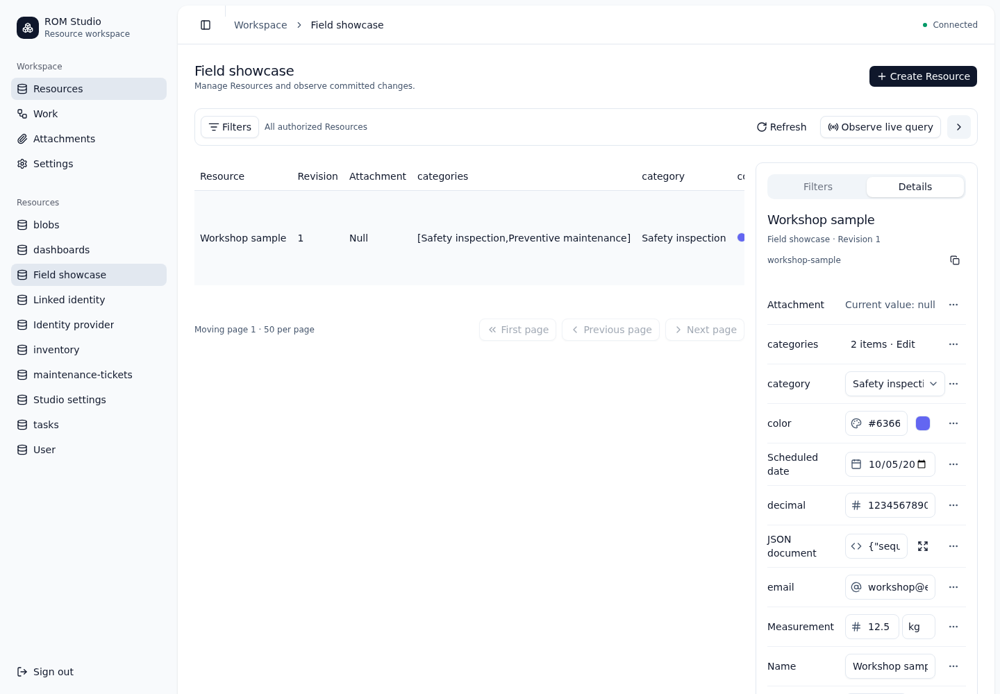
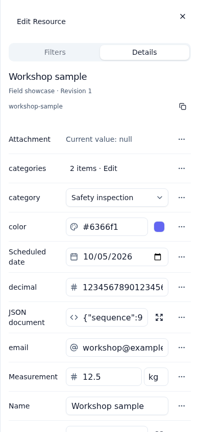
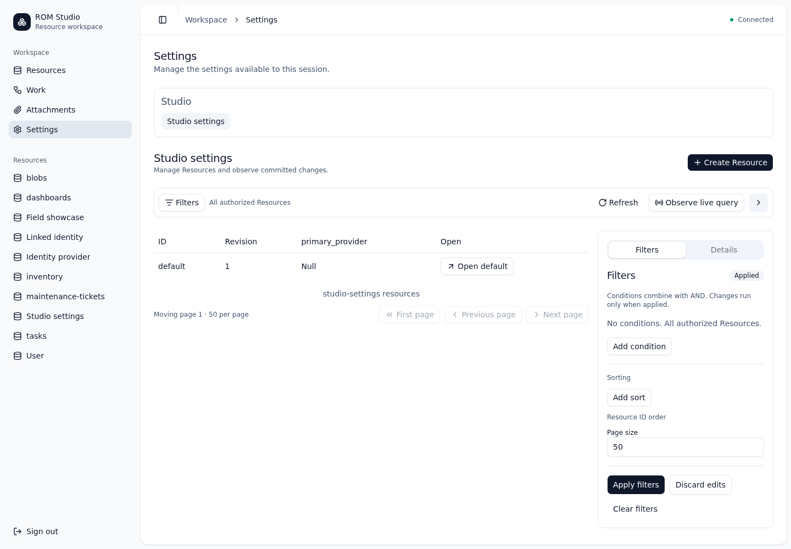
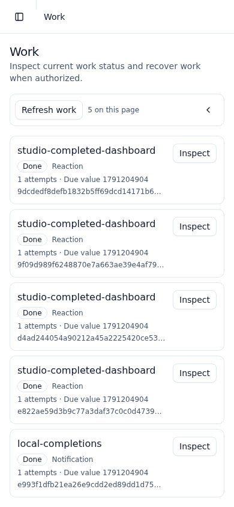
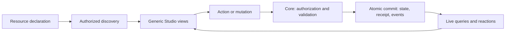

# ROM — Resource Oriented Meta Framework

A backend-first Rust library built around one domain entity: the **resource**.

Declare a resource once. The framework supplies standard storage, operations, endpoints and reactive reads. Applications add domain behavior without a separate repository, controller or broadcaster for each resource kind.

Actions request changes. The core validates and commits transitions. Events describe committed facts. Reactions can submit further actions through the same core.

**Status: ROM 0.1.0 is an experimental source release.**
The owner authorized publication before the remaining release gates passed.
The complete verifier and the target mixed-load acceptance remain incomplete.
Read the [0.1.0 release notes](docs/releases/0.1.0.md) before deployment.
This release does not establish production readiness.

**Historical baseline: ROM 0.0.3 passed complete local release and persistent preview acceptance.**
The eight-gate producer accepted source revision `584c01b614127b3f62799f1a26a1cdf3f734c3dc`.
An independent verifier accepted the source, Studio, and skills artifacts.
The explicit application passed 28 host/browser cases across SQLite/redb and Chromium/WebKit.
The persistent [VPN preview](https://10.66.0.2/rom-studio/) passed fresh-login checks and a full container restart.
See the [completion record](docs/research/rom-0.0.3-release-completion.md), [compatibility review](docs/research/rom-0.0.3-compatibility.md), and [support boundary](docs/release-support.md).
GitHub hosts source only. Registry publication and GitHub Actions remain disabled.
The corrected demo bootstrap preserves edited and deleted seeded Resources across restart.
The application tests use an isolated corrected WPE runtime; earlier native browser failures remain documented.
These results do not establish production readiness or human usability.

The historical native source alpha, `0.1.0-alpha.1`, passed the complete local release procedure for its library, CLI, adapters, and reference application. See its [completion audit and support limits](docs/research/framework-release-completion.md), [completed release checklist](openspec/changes/prepare-framework-release/tasks.md), and [earlier MVP evidence](docs/research/mvp-release-results.md).

## Try the MVP

With Rust 1.99, run `./demo/run smoke` from this repository. This command tests the complete local flow with SQLite. `./demo/run smoke redb` uses the other adapter. Follow the [author workshop](demo/README.md) for resource declarations, live queries and a persistent local server.

The generic [command-line client](docs/cli.md) now supports discovery, queries, mutations, live snapshots and journal streams. Run `cargo run --locked -p rom-cli -- --help` to start. See the [core/CLI verification results](docs/research/core-cli-results.md).

Studio uses Svelte and shadcn-svelte components with shared Resource descriptors, field renderers, forms, tables, and action controls. The optional Rust host supplies human OIDC login and server-side sessions. [Browser acceptance](docs/research/rom-0.0.2-full-browser-workflows-results.md) covers Task and Inventory workflows on SQLite and redb in Chromium and WebKit. The [external author example](docs/research/rom-0.0.2-studio-author-workflow.md) uses a public entry point and a custom renderer from extracted Studio source. The [packaged release and persistent preview](docs/research/rom-0.0.2-release-completion.md) also passed acceptance. These tests do not establish production readiness or human usability.

The opt-in [provider deployment profile](docs/provider-deployment.md) adds explicit service provisioning, private secret references, and authentication through a real provider. Its [verification record](docs/research/provider-deployment-results.md) separates integration trials from the final release gates.

## ROM Studio

Studio is a generic workspace for backend operations on ROM Resources. It uses Svelte 5, shadcn-svelte, Bits UI, and Lucide icons.

These screenshots show the implemented 0.0.3 workspace on a real local host with synthetic data.
They are not design mockups. The permanent VPN deployment has separate release-bound acceptance.
The [capture record](docs/research/evidence/rom-0.0.3/studio-screens/source-facts.json) identifies source, native binary, and assets.



The desktop layout has Resource navigation on the left, a table in the center, and a shared Filters/Details inspector on the right.
The right-edge chevron opens or closes that inspector.
Quick filters remain in a popover. The sidebar provides the full filter and sorting controls.

<details>
<summary>Mobile Resource fields</summary>



</details>

On narrow screens, the panel opens as a drawer. Action buttons use icons where space is limited; wide layouts retain text beside icons.
Simple form fields use compact rows with labels. Collections open a larger editor instead of expanding every row.

| Workspace | Current behavior |
| --- | --- |
| Resources | Discover authorized Resource kinds, query rows, and open their details. |
| Forms and actions | Create, patch, replace, or delete state; invoke actions from their input descriptors. |
| Filters | Apply descriptor-based filters, sorting, and moving pagination. |
| Live queries | Observe changing authorized results without subscription code for each Resource kind. |
| Work | Inspect readable work snapshots and perform authorized retry or reconciliation through the shared right inspector. |
| Settings | Manage ordinary Settings Resources and authorized plugin groups through the same forms and actions. |
| Attachments | Reserve, upload, download, and detach through the Blob boundary. |
| Login | Use human OIDC login and server-side sessions through the optional Rust host. |

<details>
<summary>Settings and mobile Work inspection</summary>





</details>

Work shows authoritative snapshots. It does not invent a timeline when the host supplies no work history.
Settings metadata organizes navigation; it does not grant configuration permissions.

### How a Resource reaches Studio

A Rust declaration supplies the Resource contract. Discovery exposes authorized descriptors to Studio.
The same descriptors drive tables, field controls, action inputs, and query controls.
An application does not need a new controller or form implementation for each ordinary Resource kind.



Studio submits operations through the shared client contract. The core enforces authorization, validation, revisions, and durable idempotency.
A form edit is a draft until submission. An uncertain response does not prove that a mutation failed.
Studio can retry the same accepted request to recover its receipt without requesting a second change.

### Current field coverage

Studio has generic controls for strings, booleans, exact integers, finite numbers, enums, references, lists, and maps.
Optional and nullable fields retain the distinction between absence, null, removal, and an unchanged value.
Custom codecs use a renderer registered for their exact name and version.

A missing custom renderer preserves the value and blocks unsafe editing.
Application entry points explicitly register trusted custom components for an exact codec name and version.
The standard Studio bundle does not load application extensions automatically.

The 0.0.3 field catalog adds enum labels, ordered multi-choice lists, drag-and-drop sorting, and bounded reference pickers.
Standard controls cover dates, times, timestamps, colors, email, URLs, multiline text, exact JSON source, decimals, and units.
Invalid drafts stay local and block submission. Decimal editing does not use JavaScript floating-point conversion.
See [field contracts and limits](docs/studio-fields.md), including lexical decimal sorting and bounded candidate search.

The Studio workspace also provides authorized human titles, a shared right inspector, readable Work inspection, and plugin Settings groups.
The accepted 0.0.3 distribution contains these changes. The screenshot capture record identifies its earlier, unchanged UI source.
See [presentation authoring](docs/studio-presentation.md), [release scope](docs/research/rom-0.0.3-studio-release-research.md),
and [the release plan](docs/superpowers/plans/2026-10-05-rom-0.0.3-release.md).
Use [AI development guidance](docs/ai-development.md) to select the Resource, extension, operator, release, or Studio workflow.

The [external Studio author workflow](docs/research/rom-0.0.2-studio-author-workflow.md) demonstrates explicit custom renderer registration.
The demo renderer is registered by the `studio-demo` build entry point; the standard Studio build does not load that extension.
See [Studio client contracts](docs/research/rom-studio-client-contract.md) and [field UX evidence](docs/research/rom-studio-field-ux-proposal.md).

### Run and verify

From the repository root, run the native smoke journey:

```sh
./demo/run smoke
./demo/run smoke redb
```

These commands verify backend flows. They do not start the Studio login host.
For a local browser deployment, follow the [Studio author workflow](docs/research/rom-0.0.2-studio-author-workflow.md).
For persistent deployment, follow the [NixOS preview documentation](infra/nixos/README.md).

To verify and build the frontend assets:

```sh
cd studio
npm ci
npm run check
npm run build
```

The assets use the `/rom-studio/` base path. A complete deployment also needs the matching Rust host and a configured identity provider.
The private VPN preview at `https://10.66.0.2/rom-studio/` is specific to the owner's environment.
It is not a public demo endpoint. The demonstration provider needs a new login after a restart.

## Design

- One main ROM library with typed resources and extensible field types.
- Tokio for asynchronous execution and I/O, Rayon for CPU-heavy work; the maintained core supervises accepted work independently of caller cancellation.
- Persistence contracts owned by the core, database implementations supplied by adapters.
- Rust extension interfaces first; optional WASM implementations later.
- HTTP and RabbitMQ integrations remain separate extensions.
- Every mutation follows the same validation, concurrency and event guarantees.

Start with the [OpenSpec proposal](openspec/changes/establish-rom/proposal.md), [design](openspec/changes/establish-rom/design.md), and [tasks](openspec/changes/establish-rom/tasks.md). See [planning](docs/planning.md) for the workflow inspired by Beskid.

## License

[MIT](LICENSE). Copyright © 2026 Piotr Mikstacki.

## Design research

Research informs the design; candidate crates are not an approved dependency list.

- [Complete research and prototype index](docs/research/completion-index.md)
- [All 37 deferred capabilities: research, recommendations and acceptance probes](docs/research/deferred-capabilities-roadmap.md)
- [CLI implementation choices and failure boundaries](docs/research/cli-implementation-research.md)
- [Core/API/CLI results and remaining scope](docs/research/core-cli-results.md)
- [Independent core and CLI review](docs/research/core-cli-independent-review.md)
- [Structured action payloads](docs/action-inputs.md)
- [Authorized Resource discovery](docs/discovery.md)
- [Executable author workshop](demo/README.md)
- [Service provider deployment and recovery](docs/provider-deployment.md)
- [Provider deployment tests and review findings](docs/research/provider-deployment-results.md)
- [Configuration ingestion](docs/research/maintained-configuration-results.md)
- [Blob lifecycle and real storage trials](docs/research/mvp-blob-results.md)
- [Backup and recovery](docs/research/maintained-backup-results.md)
- [Retention and retry epochs](docs/retention.md)
- [RIM source assessment and ideas carried into ROM](docs/research/rim-source-assessment.md)
- [Framework comparisons and Rust crate candidates](docs/research/frameworks-and-rust-crates.md)
- [2026-10-03: parallel experiments, maintained changes and next steps](docs/research/2026-10-03-results.md)
- [Query authoring and three execution strategies: measured results](docs/research/query-planning-results.md)
- [Small strategy selector and database planner adapters: prototype results](docs/research/query-selector-results.md)
- [Optimizer adoption cost and scientific basis](docs/research/optimizer-adoption-cost.md)
- [Explicit compensation: forty cases and recovery evidence](docs/research/compensation-probe-results.md)
- [ROM skills library and executable author templates](docs/research/rom-skills-library-research.md)
- [WASM extension boundary and bounded engine trials](docs/research/wasm-extension-research.md)
- [Six-framework comparison and ranked recommendations](docs/research/state-of-art-resource-frameworks.md)
- [Prototype findings and implementation tradeoffs](docs/research/prototype-results.md)
- [Integrated typed core: executed evidence and promotion gaps](docs/research/integrated-core-probe-results.md)
- [Maintained bounded execution, expiry and live delivery results](docs/research/maintained-foundation-results.md)
- [SQLite/redb shared atomic bundle and process-exit conformance](docs/storage-adapters.md)
- [Independent promotion review and regression requirements](docs/research/integrated-core-promotion-review.md)
- [Reactive chains: 19 tests, 110 comparisons and loop-control recommendations](docs/research/reaction-chain-results.md)
- [Configuration loaders: 24 executed tests and critique](docs/research/configuration-trial-results.md)
- [Native User/provider mapping and field projection](docs/research/maintained-identity-projection.md)
- [Maintained HTTP and durable journal](docs/research/maintained-http-journal.md)
- [Maintained typed reactive chains](docs/research/maintained-reaction-results.md)
- [Durable notification channels](docs/research/maintained-channel-results.md)
- [Presence, null and typed partial changes](docs/presence-and-patch.md)
- [Maintained authentication: reviewed profiles and integration boundary](docs/research/maintained-auth-results.md)
- [Immutable experiment reproduction](docs/research/reproducing-experiments.md)
- [JWT and introspection profiles: executed verification and remaining integration](docs/research/auth-provider-probe-results.md)
- [Tower/direct transport contracts: 15 executed tests and critique](docs/research/transport-trial-results.md)
- [All MVP decisions, recommendations and completion inventory](docs/research/mvp-decision-register.md)
- [Interchangeable adapters and resilience: executed findings](docs/research/capability-prototype-results.md)
- [Internal cache, single-flight and Salsa: executed findings](docs/research/cache-prototype-results.md)
- [Cache crate contracts and selection criteria](docs/research/internal-cache-research.md)
- [Architecture cohesion and remaining integration gaps](docs/research/architecture-cohesion-review.md)
- [Technology fit and authoring friction review](docs/research/technology-fit-review.md)
- [Core-owned transport layer and extension contracts](docs/research/transport-layer-review.md)
- [ROM Studio: curated screens and generic resource views](docs/research/rom-studio-product-research.md)
- [ROM Studio: Svelte rendering and dependency compatibility](docs/research/rom-studio-frontend-research.md)
- [ROM Studio: component maintenance and selection](docs/research/rom-studio-controls-research.md)
- [ROM Studio: shared discovery and client contract](docs/research/rom-studio-client-contract.md)
- [Configuration Resources, source ownership and activation](docs/research/configuration-resource-contract.md)
- [Hierarchical configuration provider candidates](docs/research/configuration-provider-research.md)
- [Beskid's implemented configuration hierarchy and lessons](docs/research/configuration-beskid-lessons.md)
- [Generic persistence, blob and notification contracts](openspec/changes/design-capability-adapters/design.md)
- [Human-friendly Rust authoring: derives and fluent APIs](docs/research/rust-resource-authoring.md)
- [Executed derive and builder crate trials](docs/research/authoring-crate-trials.md)
- [Reusable core work packages and estimation readiness](docs/research/core-implementation-readiness.md)
- [Beskid compiler and Rust quality lessons](docs/research/beskid-compiler-lessons.md)
- [Concurrency experiments and guarantees](docs/research/rust-concurrency.md)
- [Provider-neutral authentication and authorization](docs/research/auth-architecture.md)
- [Auth specification proposal](openspec/changes/design-provider-neutral-auth/proposal.md)

[Quality gates](docs/quality.md) turn the [Beskid baseline audit](docs/research/beskid-quality-baseline.md) into concrete delivery criteria.

## Development

The completed [framework release program](openspec/changes/prepare-framework-release/tasks.md)
covers reference-app/API ergonomics, relations and migrations, measured
execution optimization, then operational recovery and release preparation.
[Progress and evidence](docs/research/framework-release-progress.md) record
the delivered slices and their acceptance checks.
The [source support boundary](docs/release-support.md) defines the native alpha profile.
The [completion audit](docs/research/framework-release-completion.md) records final acceptance status.
Use the [local artifact procedure](scripts/release-artifacts/README.md) to prepare a verified source distribution.

For local verification, run `./scripts/check`. To build, run `./scripts/build`. The initial tested Rust floor is 1.99.0. See the [persistent NixOS environment](infra/nixos/README.md). GitHub Actions is disabled. The [consumer](examples/consumer/src/main.rs) exercises two Resources through the public library; the [demo](demo/README.md) now combines the maintained packages in an executable author workshop.

```sh
nixos-container run rom-dev -- bash -lc 'cd /workspace/ROM && ./scripts/check'
nixos-container run rom-dev -- bash -lc 'cd /workspace/ROM && cargo run -p rom-consumer --locked'
```

The maintained foundation now has bounded asynchronous reads, actions and live
queries, cancellation-safe shutdown, actor expiry, and SQLite/redb conformance.
Field projection, verified-identity mapping to User Resources, durable reaction
workers, notification channels and generic HTTP are integrated. Partial changes
preserve missing/null/removal, and queries share typed and wire semantics.
Configuration ingestion, Blob lifecycle, native backup/recovery and the assembled
demo are integrated. [Final review](docs/research/maintained-mvp-independent-review.md) and release checks cover their combined behavior.
The [maintained verification record](docs/research/maintained-foundation-results.md)
and [storage contract](docs/storage-adapters.md) supersede the corresponding
limitations of the original disposable probe.

Package verification builds all maintained library package archives. It runs the CLI
and a library consumer outside this workspace. Inside `rom-dev`, run `node scripts/check-packages.mjs`.
This does not publish packages to crates.io.

[Research and prototype program](docs/research/prototype-program.md) records the fixed premise and the experiments used to validate implementation choices.
